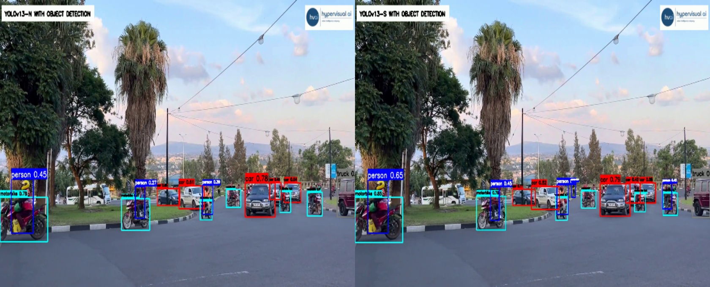
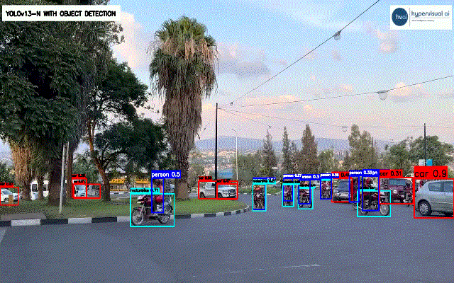
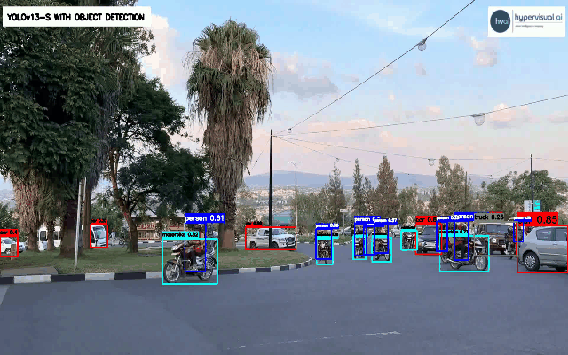

### AI dev - HyVi detection                                                                                        
Hypervisual AI Company is currently developing a project that incorporates YOLOv13-N and YOLOE-11-S, with plans to integrate ViT-B-16 in future iterations.
                                                                                                                                                                                           
### Install Dependencies                                                                                                                                                                       
1. git clone https://github.com/HypervisualAI-source/AI_dev-HyVi_detection.git                               
2. cd AI_dev-HyVi_detection
3. python3 -m venv venv_benchmark
4. source venv_benchmark/bin/activate
5. pip3 install -r requirements_benchmark.txt
6. python3 -m venv venv
7. source venv/bin/activate
8. pip3 install -r requirements.txt
                                                               
### Usage Guide                                                                     
                                                                                                                                                                                                                                                
1. Training Model                           
                                                                                                                                                                   
    cd ./src/YOLOv13-N/
                                                                                                                                                                                                  
	python3 train.py                                                      
	                                                                                           
2. Inferencing Model                                
   
    cd ./src/YOLOv13-N/
                                             
	python3 inference.py
	                                                     
3. Comparing with benchmark
                                                                                                                                                                                                                       
    cd ./src/YOLOv13-N/
                                                                                  
	3.1 For YOLOv8
   										                                            														
    python3 comparison_yolov8.py

    3.2 For YOLOv9

	python3 comparison_yolov9.py
	
	3.3 For YOLOv10

	python3 comparison_yolov10.py

    3.4 For YOLOv11
   
    python3 comparison_yolov11.py
	
    3.5 For YOLOv13-S                                                           
	
	cd ./src/YOLOv13-S/                                                                                                                                                                                 

	python3 YOLOv13_S.py
	
	    

4. Demonstrating YOLOv13-N

    cd ./demos/YOLOv13-N/
   
	python3 demo.py 

    4.1 Demonstrating YOLOv13-N in shell script file
   
        chmod +x demo.sh
   
	    ./demo.sh
		
5. Demonstrating YOLOv13-S

    cd ./demos/YOLOv13-S/
   
	python3 demo.py 

    5.1 Demonstrating YOLOv13-S in shell script file
   
        chmod +x demo.sh
   
	    ./demo.sh
6. Demonstrating YOLOE-11-S

    cd ./demos/YOLOE-11-S/
   
	python3 demo.py 

    6.1 Demonstrating YOLOE-11-S in shell script file
   
        chmod +x demo.sh
   
	    ./demo.sh

7. Demonstrating ViT-B-16
   
    cd ./demos/ViT-B-16/
   
	python3 demo.py                  
                                       
    7.1 Demonstrating ViT-B-16 in shell script file
   
        chmod +x demo.sh
                                                              
	    ./demo.sh
                                                                                                                                                                                                                                                                                                                                                                                                                                                                                                                                                                                                                                                                                                                                                                                                                                                                                                   
                                                                                                                                                                                                                                                                                                                                                                                                                                                                                                                                                                                                                                                                                                                                                               
### Benchmark                                                                                                                                                             
| Model | Parameters(M) | GFLOPs| Latency(ms) 640(pixel) CPU(12th Gen Intel(R) Core(TM) i5-12400)| mAP50_95 coco(val)|  
|-------|-----|----------|---------------------------- |-----------------|                                                                                                            
| [YOLOv8n](https://github.com/ultralytics/assets/releases/download/v0.0.0/yolov8n.pt) | 3.2 | 8.9 | 26.00 | 37.1 |                      
| [YOLOv8s](https://github.com/ultralytics/assets/releases/download/v0.0.0/yolov8s.pt) | 11.2 | 28.8 | 59.00 | 44.8 |
| [YOLOv8m](https://github.com/ultralytics/assets/releases/download/v0.0.0/yolov8m.pt) | 25.9 | 79.3 | 136.00 | 50.2 |
| [YOLOv8l](https://github.com/ultralytics/assets/releases/download/v0.0.0/yolov8l.pt) | 43.7 | 165.7 | 257.00 | 53.1 |
| [YOLOv8x](https://github.com/ultralytics/assets/releases/download/v0.0.0/yolov8x.pt) | 68.2 | 258.5 | 381.00 | 54.1 |
| [YOLOv9t](https://github.com/ultralytics/assets/releases/download/v8.3.0/yolov9t.pt) | 2.1 | 8.5 | 39.00 | 37.8 |               
| [YOLOv9s](https://github.com/ultralytics/assets/releases/download/v8.3.0/yolov9s.pt)| 7.3 | 27.6 | 76.00 | 46.4 |                   
| [YOLOv9m](https://github.com/ultralytics/assets/releases/download/v8.3.0/yolov9m.pt) | 20.2 | 77.9 | 160.00 | 51.5 |
| [YOLOv9c](https://github.com/ultralytics/assets/releases/download/v8.3.0/yolov9c.pt) | 25.6 | 104.0 | 202.00 | 52.9 |
| [YOLOv9e](https://github.com/ultralytics/assets/releases/download/v8.3.0/yolov9) | 58.2 | 193.0 | 401.00 | 55.3 | 
| [YOLOv10n](https://github.com/ultralytics/assets/releases/download/v8.3.0/yolov10n.pt) | 2.8 | 8.7 | 26.00 | 38.4 | 
| [YOLOv10s](https://github.com/ultralytics/assets/releases/download/v8.3.0/yolov10s.pt) | 8.1 | 25.1 | 55.00 | 46.2 | 
| [YOLOv10m](https://github.com/ultralytics/assets/releases/download/v8.3.0/yolov10m.pt) | 16.6 | 64.5 | 119.00 | 51.1 | 
| [YOLOv10b](https://github.com/ultralytics/assets/releases/download/v8.3.0/yolov10b.pt) | 20.6 | 99.4 | 169.00 | 52.5 | 
| [YOLOv10l](https://github.com/ultralytics/assets/releases/download/v8.3.0/yolov10l.pt) | 25.9 | 127.9 | 215.00 | 53.2 | 
| [YOLOv10x](https://github.com/ultralytics/assets/releases/download/v8.3.0/yolov10x.pt) | 31.8 | 171.8 | 275.00 | 54.5 |  
| [YOLO11n](https://github.com/ultralytics/assets/releases/download/v8.3.0/yolo11n.pt) | 2.6 | 6.6 | 28.00 | 39.2 |  
| [YOLO11s](https://github.com/ultralytics/assets/releases/download/v8.3.0/yolo11s.pt) | 9.5 | 21.7 | 56.00 | 46.8 |  
| [YOLO11m](https://github.com/ultralytics/assets/releases/download/v8.3.0/yolo11m.pt) | 20.1 | 68.5 | 136.00 | 51.5 |                                                             
| [YOLO11l](https://github.com/ultralytics/assets/releases/download/v8.3.0/yolo11l.pt) | 25.4 | 87.6 | 174.00 | 53.4 |  
| [YOLO11x](https://github.com/ultralytics/assets/releases/download/v8.3.0/yolo11x.pt) | 57.0 | 196.0 | 334.00 | 54.9 |                                                                                                  
| **[YOLOv13n](https://github.com/iMoonLab/yolov13/releases/download/yolov13/yolov13n.pt)** | **2.5** | **6.5** | **41.40** | **41.4** | 
| [YOLOv13s](https://github.com/iMoonLab/yolov13/releases/download/yolov13/yolov13s.pt) | 9.1 | 21.2 | 78.21 | 47.9 |  
                                                                                                                                                                                                                      
                                                                                                                                                                                                                                                                                                                                                                                                                                                                                                                                        
                                                                                                                                                                                                                                                                                                                                                                                                                                                                                                                                                                                                                                                                                                                                                                                                                                                                                                                                                                                                                                                                                                                                                                                                                                                                                                                                                                                                                                                                                                                                                                                                                                                                                                                                             
### Demos                                                                                                                                                                                                            
#### Features                                                                                                                                                                                     
| Model | Frame size | Display  | Inference time (average/ms) | FPS (average/s) |   CPU   |
|-------|-----|----------|---------------------------- |-----------------|---------|
| YOLOv-13-N|(3, 640, 640) | 1920 x 1080  | 39 | 13 | 12th Gen Intel(R) Core(TM) i5-12400 |
| YOLOv-13-S|(3, 640, 640) | 1920 x 1080  | 78 | 8 | 12th Gen Intel(R) Core(TM) i5-12400 |                        
| ViT-B-16|(3, 224, 224) | 1920 x 1080  | 95 | 8 | 12th Gen Intel(R) Core(TM) i5-12400 |
                                                                                                                                                                                                                                           
                                                                                                                                                                                                                                           
#### YOLOv13-N for detection (30ms/frame)

                                                                                                                                                                                      
#### YOLOv13-S for detection (30ms/frame)

                       
#### ViT-B-16 for classification (30ms/frame)
                            
                                                                                                                                                                                                                                           
### Improvements                                                                                                                                                                                                                           
#### v0.0.rc6
Compared to the version (v0.0.rc5), the improvements of the version (v0.0.rc6) are:
1. Compared with YOLOv13-S
                                                                                                                                                                                                                              
                                                                                                                                                                         

